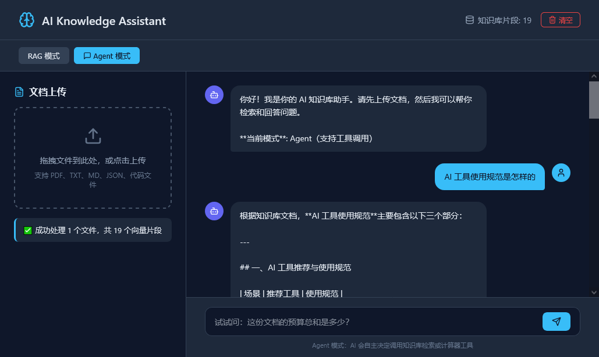

# 🤖 AI Knowledge Assistant - TypeScript 全栈版

基于 **TypeScript + Vercel AI SDK + React** 的个人知识库问答助手，支持 RAG 检索增强生成与 Agent 工具调用。

## 技术栈

| 层级 | 技术 | 说明 |
|------|------|------|
| 前端 | React 18 + Vite + TypeScript | 现代化 Chat UI，流式输出、拖拽上传 |
| 后端 | Express + TypeScript | RESTful API，SSE 流式支持 |
| AI 编排 | Vercel AI SDK (`ai` + `@ai-sdk/openai`) | Tool Calling、流式生成、Agent 编排 |
| 向量检索 | 自研内存向量库 + OpenAI Embedding | 余弦相似度 Top-K 检索 |
| 文档处理 | `pdf-parse` + 递归文本分割 | 支持 PDF / TXT / MD / 代码文件 |

## 项目亮点

- **全 TypeScript 技术栈**：前后端统一类型定义，端到端类型安全
- **双模式切换**：RAG 模式（纯检索生成）/ Agent 模式（工具自主决策）
- **ReAct Agent**：LLM 自主调用知识库检索和计算器工具，支持多轮 Tool Calling
- **模块化架构**：VectorStore → RAG → Agent 三层解耦，可替换为 Chroma/Pinecone
- **工程化实践**：Zod Schema 验证、错误处理、日志追踪

## 快速开始

### 1. 安装依赖

```bash
# 后端
cd backend
npm install

# 前端（新开终端）
cd frontend
npm install
```

### 2. 配置 API Key

```bash
cp backend/.env.example backend/.env
# 编辑 backend/.env，填入你的 API Key
```

推荐使用 **DeepSeek**（国内直连、便宜）：
```
OPENAI_API_KEY=sk-your-deepseek-key
OPENAI_BASE_URL=https://api.deepseek.com/v1
LLM_MODEL=deepseek-chat
```

### 3. 启动服务

```bash
# 后端（端口 3001）
cd backend
npm run dev

# 前端（端口 5173，自动代理 /api 到后端）
cd frontend
npm run dev
```

浏览器访问 `http://localhost:5173`

## 使用指南

### 1. 上传文档
- 拖拽或点击上传 PDF / TXT / MD / 代码文件
- 系统自动提取文本 → 分割 → 向量化 → 存入知识库

### 2. RAG 模式
- 直接基于检索到的文档片段生成答案
- 适合："这份文档讲了什么？"、"总结第三章内容"

### 3. Agent 模式（推荐）
- AI 自主决策调用工具：
  - `searchKnowledgeBase`：检索知识库
  - `calculator`：执行数学计算
- 适合："这份文档里的预算总和是多少？"（先检索再计算）

## 项目结构

```
ai-knowledge-assistant-ts/
├── backend/
│   ├── src/
│   │   ├── index.ts          # Express 主入口
│   │   ├── config.ts         # 环境配置
│   │   ├── vector-store.ts   # 向量存储（内存版）
│   │   ├── rag.ts            # RAG 核心（文档处理 + 检索）
│   │   └── agent.ts          # Agent 编排（Tool Calling）
│   ├── package.json
│   └── tsconfig.json
├── frontend/
│   ├── src/
│   │   ├── App.tsx           # 主布局
│   │   ├── DocumentUpload.tsx # 文档上传组件
│   │   └── Chat.tsx          # 对话组件
│   ├── package.json
│   └── vite.config.ts
└── README.md
```

## 进阶：替换生产级向量数据库

当前使用内存向量库，适合学习和演示。生产环境替换为 ChromaDB：

```typescript
// vector-store.ts
import { ChromaClient } from 'chromadb'

// 或使用 Pinecone
import { Pinecone } from '@pinecone-database/pinecone'
```

## 截图



## 许可证

MIT
